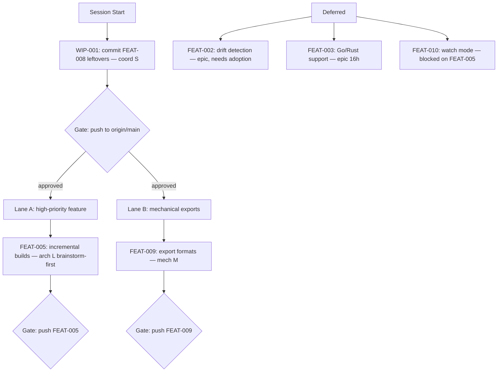

# Session Brief — 2026-04-12 (Session 5)

**Mode:** Autonomous LLM execution
**Last session:** Designed and implemented FEAT-008: Edge confidence scoring. Full pipeline with ConfidenceKind enum, resolver confidence, pipeline downgrade, all reports, query filtering, MCP integration. 12 commits, 220 tests, pushed to origin/main.

## Work Graph

## Approval Gates (STOP and ask user)

1. **GATE-1** — Push WIP-001 + any early commits to origin/main
   - Risk: low
   - Status: ready
   - Command: `git push origin main`
2. **GATE-2** — Push FEAT-005 to origin/main
   - Risk: low
   - Status: blocked-on FEAT-005 completion
   - Command: `git push origin main`
3. **GATE-3** — Push FEAT-009 to origin/main
   - Risk: low
   - Status: blocked-on FEAT-009 completion
   - Command: `git push origin main`

## External Waits

- None — all work is local.

## Parallel Lanes

### Lane A — High-priority feature (architectural)
- **FEAT-005** — Incremental builds with SHA256 cache
  - Mode: architectural
  - Context cost: L
  - Team dispatch: solo-with-brainstorm (needs design spec first)
  - Pre-reads: `crates/graphify-cli/src/main.rs`, `crates/graphify-extract/src/walker.rs`, `Cargo.toml`
  - Done when: re-run skips unchanged files, cache file persisted, `--force` flag bypasses cache

### Lane B — Mechanical exports
- **FEAT-009** — Additional export formats (Neo4j, GraphML, Obsidian)
  - Mode: mechanical
  - Context cost: M
  - Team dispatch: direct solo execution (follows existing report pattern)
  - Pre-reads: `crates/graphify-report/src/json.rs`, `crates/graphify-report/src/html.rs`, `crates/graphify-report/src/lib.rs`
  - Done when: new format flags work in CLI, output files generated correctly

## Sequential Chains

- **FEAT-005 → FEAT-010** — FEAT-010 (watch mode) depends on FEAT-005's caching layer for incremental rebuild

## Decisions Made (don't re-debate)

- **Rust over Python** — standalone binary distribution (3.5MB vs 50-80MB)
- **petgraph over custom graph** — mature, Tarjan/SCC built-in
- **Louvain over Leiden** — no mature Rust Leiden crate
- **`is_package` via boolean parameter** — clean, testable
- **tree-sitter per call** — Parser is not Send
- **D3.js v7 vendored** — full offline self-containment
- **Force-directed layout** — simpler, proven for dependency graphs
- **SVG/Canvas auto-switch at 300 nodes**
- **Safe DOM construction** — createElement/textContent only
- **Workspace alias preservation** (BUG-007)
- **Singleton merging** (BUG-008)
- **Built-in test file exclusion** (BUG-006)
- **QueryEngine in graphify-core** (FEAT-006) — reusable for MCP
- **Re-extract on the fly** (FEAT-006) — always fresh data
- **No readline crate for REPL** (FEAT-006) — plain stdin, keep binary lean
- **GlobMatcher without external crate** (FEAT-006) — simple recursive byte matching
- **CI: strict clippy** (FEAT-004) — `-D warnings` fails the build on any lint
- **Separate binary for MCP** (FEAT-007) — keeps graphify-cli free of tokio/rmcp deps
- **Eager extraction on startup** (FEAT-007) — matches CLI pattern, instant tool responses
- **Config duplication** (FEAT-007) — small stable structs, extract later if third consumer
- **rmcp `#[tool(tool_box)]` macro** (FEAT-007) — actual API differs from docs
- **Arc wrapping for QueryEngine** (FEAT-007) — ServerHandler requires Clone
- **Per-project parameter on all tools** (FEAT-007) — optional, defaults to first project
- **Manual PartialEq/Eq for Edge** (FEAT-008) — f64::to_bits() for exact equality
- **Resolver returns confidence** (FEAT-008) — (String, bool, f64) tuple, never upgrade past extractor
- **Bare calls at 0.7/Inferred** (FEAT-008) — unqualified names are uncertain
- **Non-local downgrade to 0.5/Ambiguous** (FEAT-008) — external edges capped
- **Edge merge keeps max confidence** (FEAT-008) — most confident observation wins

## Out of Scope

- FEAT-002 (reason: architectural, needs adoption data to define "drift")
- FEAT-003 (reason: epic 16h, needs own session — new tree-sitter grammars)
- FEAT-010 (reason: blocked on FEAT-005)

## Context Budget Plan

- **Start of session**: read this brief (~3k tok)
- **WIP-001 + GATE-1**: minimal context, ~5% used
- **Lane A (FEAT-005)**: brainstorm + design + implement = L context, expect ~60% by completion
- **Before Lane B**: recommend `/clear` + re-read brief if context >70%
- **Lane B (FEAT-009)**: mechanical, ~M context addition

## Re-Entry Hints (survive compaction)

If context resets mid-session:
1. Re-read `.claude/session-brief.md` (this file)
2. Run `git log origin/main..HEAD --oneline` to see what shipped since brief was written
3. Run `cargo test --workspace 2>&1 | tail -5` to verify test state
4. Resume from the first unchecked item in the work graph

## Team Dispatch Recommendations

- **WIP-001**: direct solo — trivial commit (coordination)
- **Lane A** (FEAT-005, 1 architectural task): solo after brainstorm — needs design spec, cross-crate changes
- **Lane B** (FEAT-009, 1 mechanical task): direct solo execution — follows established report pattern
- **Pre-push check**: run `cargo test --workspace` + `cargo clippy` before each GATE
