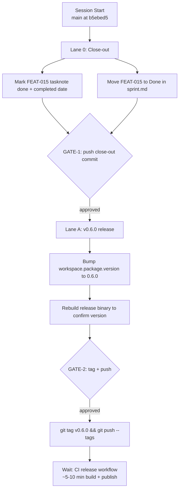

# Session Brief — Next Session (Session 9)

**Mode:** Short close-out session
**Last session:** Session 8 — shipped FEAT-015 implementation (21 commits on `main`, 442 tests, clippy clean). Feature-complete; release not yet tagged.

## Session 9 Goal — FEAT-015 close-out + v0.6.0 release

All FEAT-015 code is on `main` as of commit `b5ebed5`. This session does the bookkeeping + release tag.

## Work Graph



## Approval Gates

1. **GATE-1** — Push close-out commit (tasknote + sprint.md updates)
   - Risk: low
   - Status: blocked on Lane 0
   - Command:
     ```bash
     git add docs/TaskNotes/Tasks/FEAT-015-pr-and-editor-integration.md \
             docs/TaskNotes/Tasks/sprint.md && \
     git commit -m "chore: close FEAT-015 tasknote and sprint board" && \
     git push origin main
     ```

2. **GATE-2** — Push `v0.6.0` tag (triggers CI release)
   - Risk: medium (CI publishes binaries to 4 targets)
   - Status: blocked on Lane A
   - Command:
     ```bash
     git add Cargo.toml Cargo.lock && \
     git commit -m "chore: bump version to 0.6.0" && \
     git tag v0.6.0 && \
     git push origin main --tags
     ```

## External Waits

- **WAIT-1** — GitHub Actions release workflow. Triggered by `v0.6.0` tag push. Builds 4 targets (macOS Intel/ARM, Linux x86/ARM MUSL), uploads artifacts to the release. Estimated duration: 5–10 min. Readiness signal: green checkmark on the `Release` workflow in the Actions tab for commit `v0.6.0`.

## Lane 0 — Close-out (coordination, fast)

- **COORD-A** — `docs/TaskNotes/Tasks/FEAT-015-pr-and-editor-integration.md`
  - Mode: coordination
  - Context cost: S
  - Pre-reads: current tasknote (already has Verification section from Session 8)
  - Steps: set `status: done`, add `completed: 2026-04-??` (today's date), confirm subtasks all `[x]`
  - Done when: frontmatter reflects done state, completed date present

- **COORD-B** — `docs/TaskNotes/Tasks/sprint.md`
  - Mode: coordination
  - Context cost: S
  - Steps: change FEAT-015 row from `**open**` to `**done**`; add a Done-section entry with the date
  - Done when: sprint.md shows FEAT-015 in Done section

## Lane A — v0.6.0 release

- **REL-A** — Bump workspace version
  - Mode: coordination
  - Context cost: S
  - Pre-reads: current `Cargo.toml` (grep `version = "0.5.0"` in `[workspace.package]`)
  - Steps: edit `[workspace.package].version` from `0.5.0` to `0.6.0`; run `cargo build --release -p graphify-cli` to rebuild + update Cargo.lock
  - Done when: `./target/release/graphify --version` prints `graphify 0.6.0`

- **REL-B** — Tag + push
  - Mode: coordination
  - Context cost: S
  - Steps: `git tag v0.6.0 && git push origin main --tags`
  - Done when: tag `v0.6.0` exists on origin; CI Release workflow starts

## Sequential Chains

- **COORD-A/B → GATE-1 → REL-A → GATE-2 → REL-B → WAIT-1**

## Decisions Made (don't re-debate)

*(carried over from prior sessions)*
- Rust over Python — standalone binary distribution
- petgraph, Louvain, tree-sitter per call
- `is_package` boolean, workspace alias preservation, singleton merging
- QueryEngine in graphify-core, re-extract on the fly
- CI strict clippy `-D warnings`
- MCP separate binary with rmcp, Arc-wrapped QueryEngine
- Confidence: resolver tuple, bare calls 0.7/Inferred, non-local downgrade 0.5/Ambiguous
- Cache on by default, `.graphify-cache.json` per project
- Louvain tie-breaking deterministic
- Integration test harness builds graphify binary on demand (OnceLock guard)
- Contract drift uses Drizzle schema + TS interface/type as paired sources
- Reports use `is_empty()` never `.len() > 0` (clippy-clean)

*(added Session 8)*
- FEAT-015 delivery surface: CLI-only `graphify pr-summary <DIR>`; no companion GitHub Action in v1; no PR-comment-posting automation; no SARIF
- FEAT-015 ecosystem: `graphify check` writes unified `check-report.json`; `CheckReport` + friends moved to public `graphify-report::check_report` module
- CLI exit-code convention: `exit(1)` for all errors (consistency with `cmd_diff`/`cmd_trend`), NOT Unix-standard exit 2
- Content philosophy: delta-first, drift-report.json is primary source; check-report.json appended as "outstanding issues" only when errors exist
- Exhaustive match (no `_ =>`) on `ContractViolation` in `summarize_contract_violation` — forces compile error when new variants are added

## Out of Scope

- Any new FEAT beyond v0.6.0 release
- Companion GitHub Action (deferred to future feature)
- PR comment auto-post / SARIF / MCP `summarize_for_pr` (deferred per spec Section 9)
- Pre-existing clippy lints in `graphify-mcp`/`graphify-extract` from Rust 1.94 (`manual_flatten`, `manual_contains`) — separate cleanup task if desired

## Context Budget Plan

- **Start**: read this brief + FEAT-015 tasknote + sprint.md + Cargo.toml ≈ 4k tok
- **After GATE-1**: no clear needed
- **After REL-B**: just watch CI complete; minimal context

## Re-Entry Hints (survive compaction)

If context resets:
1. Re-read `.claude/session-brief.md` (this file)
2. `git log origin/main..HEAD --oneline` to see any unpushed work
3. `git tag --list 'v*' --sort=-v:refname | head -3` to see latest tags
4. If the tag `v0.6.0` already exists, GATE-2 is done; watch CI.

## Team Dispatch Recommendations

- **Lane 0**: direct solo — 2 tasknote edits, trivial
- **Lane A**: direct solo — 3 file edits + tag + push, all well-specified

No subagent dispatch needed. Session should take ≤30 min LLM time.
