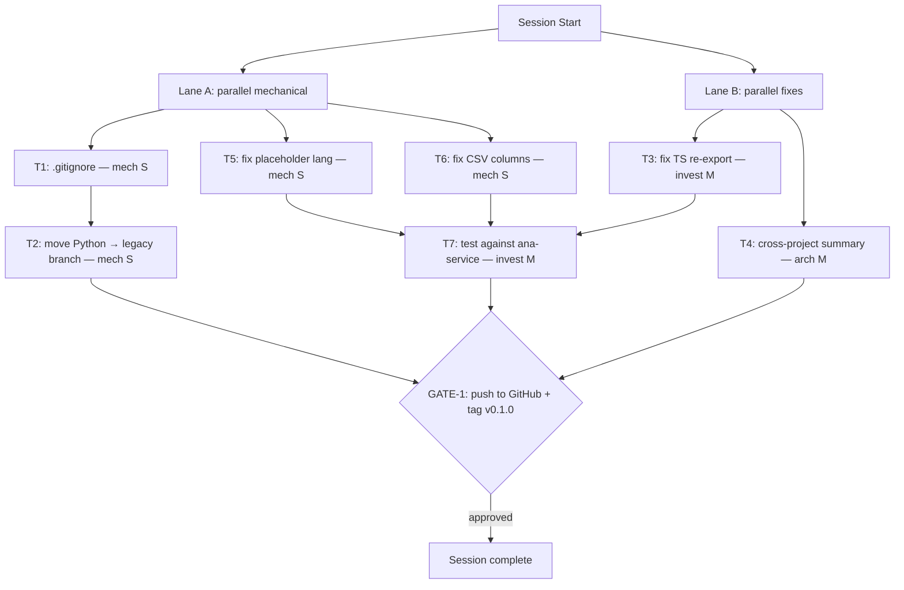

# Session Brief — 2026-04-12

**Mode:** Autonomous LLM execution
**Last session:** Complete Rust rewrite (15 tasks), post-review 3 critical fixes, CLAUDE.md updated

## Work Graph

## Approval Gates (STOP and ask user)

1. **GATE-1** — Push to GitHub remote + tag `v0.1.0`
   - Risk: low
   - Status: blocked-on-T1-T7
   - Command: `git remote add origin <url> && git push -u origin main && git tag v0.1.0 && git push --tags`

## External Waits

- None this session

## Parallel Lanes

### Lane A — Mechanical cleanup (3 tasks)
- **T1** — Add `.gitignore`
  - Mode: mechanical
  - Context cost: S
  - Team dispatch: direct solo
  - Pre-reads: repo root `ls`, common Rust `.gitignore` patterns
  - Done when: `.gitignore` exists, covers `/target`, Python artifacts, OS files
- **T5** — Fix placeholder nodes always `Language::Python`
  - Mode: mechanical
  - Context cost: S
  - Team dispatch: direct solo
  - Pre-reads: `crates/graphify-extract/src/resolver.rs`
  - Done when: Unresolved imports infer language from context (file extension or project lang)
- **T6** — Fix CSV nodes missing `kind`, `file_path`, `language` columns
  - Mode: mechanical
  - Context cost: S
  - Team dispatch: direct solo
  - Pre-reads: `crates/graphify-report/src/lib.rs`
  - Done when: CSV output includes all node fields, tests pass

### Lane B — Code fixes (2 tasks)
- **T3** — Fix TS re-export missing Defines edge
  - Mode: investigative
  - Context cost: M
  - Team dispatch: direct solo
  - Pre-reads: `crates/graphify-extract/src/typescript.rs` (export_statement handler)
  - Done when: `export { foo } from './bar'` generates Defines edge for `foo`
- **T4** — Fix cross-project summary stub
  - Mode: architectural
  - Context cost: M
  - Team dispatch: direct solo
  - Pre-reads: `crates/graphify-cli/src/main.rs` (summary generation), `crates/graphify-core/src/types.rs`
  - Done when: `graphify-summary.json` contains cross-project dependency matrix

## Sequential Chains

- **T1 → T2** — `.gitignore` before moving Python to legacy branch (clean state)
- **T3,T5,T6 → T7** — Fixes before validating against real `ana-service` codebase
- **All → GATE-1** — Everything passes before push + release

## Decisions Made (don't re-debate)

- **Rust over Python** — for standalone binary distribution (3.5MB vs 50-80MB PyInstaller)
- **petgraph over custom graph** — mature, Tarjan/SCC built-in
- **Louvain over Leiden** — no mature Rust Leiden crate; Louvain sufficient for code graphs
- **Config file over CLI flags** — `graphify.toml` as single source of truth for multi-project
- **rayon for parallelism** — embarrassingly parallel file extraction, sequential graph merge
- **No visualization** — JSON/CSV/MD output only, consumers handle visualization
- **tree-sitter per call** — Parser is not Send, so create fresh parser per extract_file call

## Out of Scope

- None deferred — all 8 tasks achievable this session

## Context Budget Plan

- **Start of session**: brief + Lane A/B pre-reads (~15k tok)
- **After Lane A+B** (5 tasks done): ~30% context used, no clear needed
- **After T7** (validation): ~50% context, consider checkpoint before GATE-1
- **GATE-1**: minimal context needed, just git commands

## Re-Entry Hints (survive compaction)

If context resets mid-session:
1. Re-read `.claude/session-brief.md` (this file)
2. Run `git log --oneline -10` to see what shipped since brief was written
3. Run `cargo test --workspace 2>&1 | tail -10` to confirm test state
4. Resume from the first unchecked item in the work graph

## Team Dispatch Recommendations

- **Lane A** (3 mechanical S tasks): parallel subagents — independent files, no shared state
- **Lane B** (2 M tasks): parallel subagents — different crates, no overlap
- **T2** (legacy branch): solo after T1, quick git operations
- **T7** (validation): solo, needs to interpret output
- **GATE-1**: user-confirmed, manual
