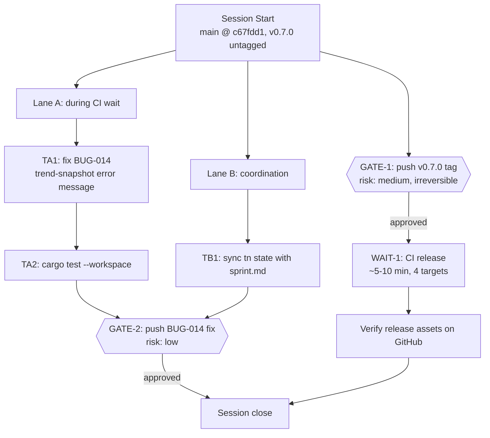

# Session Brief — 2026-04-15

**Mode:** Autonomous LLM execution
**Last session:** Session 10 — shipped FEAT-017 (hotspot classification) and FEAT-018 (AI integrations); bumped workspace to `0.7.0` in commit `c67fdd1`. Release tag never pushed — CI release did not fire.

## Entry State

- `main` @ `c67fdd1 chore(release): prepare v0.7.0` (pushed, `origin/main..HEAD` is empty)
- Release binary prints `graphify 0.7.0`; remote tags cap at `v0.6.0`
- Working tree: only `.obsidian/workspace.json` (noise) + stale `target/` deletions
- Open tasks in `tn`: **BUG-014** only (low-pri, Option A recommended — clearer error for trend-format snapshots passed to `diff`)
- `tn sprint summary` is stale vs `sprint.md` (FEAT-015/017/018 need marking done)

## Work Graph



## Approval Gates (STOP and ask user)

1. **GATE-1** — Push `v0.7.0` tag to trigger CI release
   - Risk: medium (builds + uploads 4 binaries; irreversible once CI runs)
   - Status: ready (commit already on `main`, binary confirms `0.7.0`)
   - Command:
     ```bash
     git tag v0.7.0 c67fdd1 && git push origin v0.7.0
     ```

2. **GATE-2** — Push BUG-014 fix + tn housekeeping commit(s)
   - Risk: low (isolated error-path change + test; tn JSON only)
   - Status: blocked on Lane A + Lane B
   - Command: `git push origin main`

## External Waits

- **WAIT-1** — GitHub Actions `Release` workflow
  - Trigger: `v0.7.0` tag push
  - Est. duration: 5–10 min
  - Readiness signal: green check on `Release` workflow for tag `v0.7.0`; 4 binary assets attached to the GitHub Release

## Parallel Lanes (run during WAIT-1)

### Lane A — BUG-014 fix

- **TA1** — Implement Option A from tasknote
  - Mode: `mechanical` | Context: `S` (2–3 files)
  - Team dispatch: **direct** — spec is clear, scope small
  - Pre-reads: `docs/TaskNotes/Tasks/BUG-014-*.md`, `crates/graphify-core/src/diff.rs`, `crates/graphify-core/src/history.rs`
  - Done when: helper `is_trend_snapshot` exists; `cmd_diff` branches on it; `--help` mentions requirement; CLI test asserts the new message; workspace tests green
- **TA2** — `cargo test --workspace` regression check (expect ≥442 tests passing, any new BUG-014 tests added)

### Lane B — Housekeeping

- **TB1** — Sync `tn` state with `sprint.md`
  - Mode: `coordination` | Context: `S`
  - Steps: mark FEAT-015, FEAT-017, FEAT-018 as `done` in `tn` (verb TBD — consult `tn --help` or `tn update --help` at runtime)
  - Done when: `tn sprint summary` matches `sprint.md` Done section

## Sequential Chains

- `GATE-1 → WAIT-1 → VERIFY` — release path (blocks nothing else; runs in background)
- `TA1 → TA2 → GATE-2` — BUG-014 ships only after local tests pass
- `TB1 → GATE-2` — housekeeping batched into same push as BUG-014 fix

## Decisions Made (don't re-debate)

*(carried from prior sessions)*
- Rust over Python; petgraph; Louvain + Label Propagation; tree-sitter Parser per call
- `is_package` boolean, workspace alias preservation, singleton merging
- QueryEngine in graphify-core, re-extract on the fly
- CI strict clippy `-D warnings`
- MCP separate binary with rmcp, Arc-wrapped QueryEngine
- Confidence: resolver tuple; bare calls 0.7/Inferred; non-local downgrade 0.5/Ambiguous
- Cache on by default, `.graphify-cache.json` per project
- Louvain tie-breaking deterministic
- Integration test harness builds graphify binary on demand (OnceLock guard)
- Contract drift uses Drizzle schema + TS interface/type as paired sources
- Reports use `is_empty()` (clippy-clean)
- FEAT-015 surface: CLI-only `graphify pr-summary <DIR>`
- `graphify check` writes unified `check-report.json`; `CheckReport` types in public `graphify-report::check_report`
- CLI error-exit convention: `exit(1)` everywhere
- Content philosophy: delta-first; drift-report.json primary; check-report.json appended only when errors exist
- Exhaustive `match` (no `_ =>`) on `ContractViolation` in `summarize_contract_violation`

*(added this session)*
- BUG-014 fix: **Option A** (clearer error message + `is_trend_snapshot` helper) — not Option B (full-schema history, disk cost) nor Option C (auto-reextract, infeasible without graph)

## Out of Scope

- Any new FEAT beyond what's already Done
- BUG-014 Option B (upgrade history to full analysis schema) — revisit only if cross-session drift becomes a common workflow
- Companion GitHub Action / SARIF / PR auto-post (deferred per FEAT-015 spec §9)
- Pre-existing clippy lints from Rust 1.94 (`manual_flatten`, `manual_contains`) in `graphify-mcp`/`graphify-extract` — separate cleanup

## Context Budget Plan

- **Start**: this brief + BUG-014 tasknote + `diff.rs` + `history.rs` ≈ 5–8k tok
- **After GATE-1**: no `/clear` — CI runs in background; continue Lane A
- **Mid-Lane A**: expect ~15–25% context used; no checkpoint needed
- **Before GATE-2**: should still be under 40%; `/clear` unnecessary

## Re-Entry Hints (survive compaction)

If context resets mid-session:
1. Re-read `.claude/session-brief.md` (this file)
2. `git log origin/main..HEAD --oneline` — see unpushed work
3. `git tag --list 'v0.7*' --sort=-v:refname` — if `v0.7.0` exists, GATE-1 done; check GitHub Release assets
4. `tn list --status in_progress` — any task mid-flight
5. `cargo test --workspace` last status — if red, fix before GATE-2
6. Resume from the first unchecked node in the work graph

## Team Dispatch Recommendations

- **Lane A (BUG-014)**: direct solo — Option A spec is explicit; 1 helper + 1 branch + 1 test
- **Lane B (tn sync)**: direct solo — pure CLI calls
- **No subagent dispatch warranted.** Session should take ≤45 min LLM time including CI wait.
