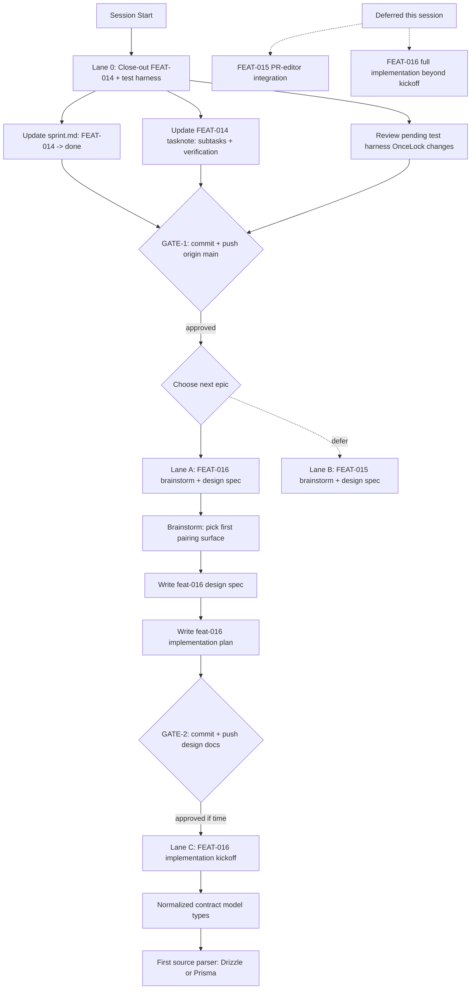

# Session Brief — 2026-04-13 (Session 7 — closed)

**Mode:** Autonomous LLM execution
**Last session:** Session 6 — shipped FEAT-009 (Neo4j/GraphML/Obsidian exports), FEAT-010 (watch mode), FEAT-002 (drift detection), FEAT-011 (auto-detect prefix), FEAT-004 (CI quality gates), FEAT-003 (Go/Rust), FEAT-012 (recipes), FEAT-013 (policy rules), FEAT-014 (historical trend tracking). v0.3.0 tagged + released.

## Session 7 Outcome — FEAT-016 kickoff complete

**Shipped (pushed to origin/main):**
1. `d7aa620` — chore: close FEAT-013 + FEAT-014 tasknotes; OnceLock test harness
2. `cae3e03` — docs: FEAT-016 design spec (11 sections, 597 lines)
3. `766ce7b` — docs: FEAT-016 implementation plan (15 tasks, 3800 lines)
4. `31b4b82` — feat(core): Task 1 — data model + ContractBuilder
5. `0e50b29` — feat(core): Task 2 — field alignment
6. `9ca121f` — feat(core): Task 3 — per-field nullability + type comparison
7. `013c246` — feat(extract): Task 6 — Drizzle scalar parser
8. `6733b18` — feat(extract): Task 7 — Drizzle `$type`, `pgSchema`, multi-table
9. `766f65e` — feat(extract): Task 9 — TS interface/type parser

**FEAT-016 progress:** 6/15 tasks (40%) implemented. Design + plan complete.
**Test state:** workspace green. graphify-core contract module: 12 tests. graphify-extract drizzle: 6 tests. graphify-extract ts_contract: 4 tests.
**Clippy state:** clean on every crate FEAT-016 touched. Pre-existing `len_zero` issue in `crates/graphify-report/src/json.rs:312,313,336` (from FEAT-008 era commit `0936bf3`) — fix required before Task 12 lands so `cargo clippy -p graphify-report -- -D warnings` passes; genuinely 2 minutes of work.

## Next Session — Resume from here

**Remaining plan tasks:**
- Task 4 — Relation alignment + cardinality (core, `contract.rs`)
- Task 5 — Deterministic ordering (core, `contract.rs`)
- Task 8 — Drizzle `relations()` block parser (extract, `drizzle.rs`)
- Task 10 — TS scalar-vs-relation classification sweep (extract, `ts_contract.rs` + `lib.rs`)
- Task 11 — TS intersection flattening tests (extract, `ts_contract.rs`)
- Task 12 — Report JSON serializer (report, `contract_json.rs`)
- Task 13 — Report Markdown section (report, `contract_markdown.rs`)
- Task 14 — CLI wiring + 6 integration tests + monorepo fixture (**biggest task**, `graphify-cli/src/main.rs`)
- Task 15 — README + CHANGELOG + tasknote close + v0.5.0 bump

**Recommended next-session work graph:**

1. **Pre-task fix** (2 min) — `cargo clippy --fix` on `crates/graphify-report/src/json.rs` for the 3 `.len() > 0` patterns, OR manual rewrite to `!… .is_empty()`. Blocks Task 12 otherwise.
2. **Parallel lane** — dispatch Tasks 4, 8, 10 concurrently (all different files, no overlap).
3. **After lane 2** — dispatch Tasks 5, 11, 12 concurrently (Task 5 on `contract.rs`, Task 11 on `ts_contract.rs`, Task 12 creates `contract_json.rs`).
4. **Then** Task 13 (requires Task 12's types).
5. **Then** Task 14 solo inline — it's the integration point, many moving pieces, higher judgment call risk.
6. **Close-out** Task 15 with version bump + tag v0.5.0.

**Context budget for next session:** read plan file (large, ~80k tokens alone). Recommend clearing and re-reading only the specific task sections needed — the plan is organized by task heading and each task is self-contained.

## Rest of Session 7 brief (historical reference below)

---

## Work Graph

## Approval Gates (STOP and ask user)

1. **GATE-1** — Commit + push FEAT-014 close-out, FEAT-013 test harness fix, sprint tracker update
   - Risk: low
   - Status: ready after Lane 0 completion
   - Command: `git add docs/TaskNotes/Tasks/sprint.md docs/TaskNotes/Tasks/FEAT-014-historical-architecture-trend-tracking.md tests/integration_test.rs tests/query_integration.rs && git commit -m "chore: close FEAT-014 and harden integration test harness" && git push origin main`

2. **GATE-2** — Commit + push FEAT-016 design spec + implementation plan
   - Risk: low
   - Status: blocked on Lane A completion
   - Command: `git add docs/superpowers/specs/*feat-016*.md docs/superpowers/plans/*feat-016*.md && git commit -m "docs: design spec + plan for FEAT-016 contract drift" && git push origin main`

## External Waits

- None — fully local Rust workspace, no CI/deploy dependencies this session.

## Parallel Lanes

### Lane 0 — Close-out (mandatory, fast)
- **COORD-A** — Update `docs/TaskNotes/Tasks/sprint.md` row for FEAT-014 → **done** + Done entry
  - Mode: coordination
  - Context cost: S
  - Team dispatch: direct
  - Pre-reads: current sprint.md
  - Done when: row shows `**done**`, Done section lists FEAT-014 with 2026-04-13 date

- **COORD-B** — Update `docs/TaskNotes/Tasks/FEAT-014-historical-architecture-trend-tracking.md`
  - Mode: coordination
  - Context cost: S
  - Team dispatch: direct
  - Pre-reads: tasknote YAML frontmatter, git show 8ac4215
  - Done when: status:done, completed:2026-04-13, subtasks checked, Verification section appended

- **COORD-C** — Review uncommitted `tests/integration_test.rs` + `tests/query_integration.rs` OnceLock harness changes
  - Mode: coordination
  - Context cost: S
  - Team dispatch: direct
  - Pre-reads: already in context — auto-build via `cargo build -q -p graphify-cli --bin graphify` before integration tests
  - Done when: confirmed as intentional FEAT-013 verification fix (per FEAT-013 notes), staged for commit

### Lane A — FEAT-016 design (primary architectural)
- **FEAT-016-brainstorm** — Pick first pairing target
  - Mode: architectural
  - Context cost: M
  - Team dispatch: solo with `superpowers:brainstorming` skill
  - Pre-reads: `docs/TaskNotes/Tasks/FEAT-016-contract-drift-detection-between-orm-and-typescript.md`
  - Decision points:
    1. Backend-to-frontend (Drizzle/Prisma ↔ TS interface/type) vs backend-to-API (ORM ↔ Zod/DTO)
    2. Explicit pairing config in graphify.toml vs convention-based discovery
    3. Normalized field representation shape (name, type, nullable, relation, origin_node_id)
  - Done when: decision recorded in brief Decisions Made, spec skeleton seeded

- **FEAT-016-spec** — Write `docs/superpowers/specs/2026-04-13-feat-016-contract-drift-design.md`
  - Mode: architectural
  - Context cost: L
  - Team dispatch: solo
  - Pre-reads: existing specs under `docs/superpowers/specs/` (FEAT-002 drift spec as closest analog)
  - Done when: spec covers data sources, normalization model, comparison algorithm, CLI surface, output formats

- **FEAT-016-plan** — Write `docs/superpowers/plans/2026-04-13-feat-016-contract-drift.md`
  - Mode: architectural
  - Context cost: M
  - Team dispatch: solo
  - Pre-reads: FEAT-016 spec (just written)
  - Done when: plan enumerates concrete PRs/commits/crates/tests, ordered by dependency

### Lane C — FEAT-016 implementation kickoff (stretch, if time)
- **FEAT-016-impl-1** — Normalized contract model types + first source parser
  - Mode: architectural
  - Context cost: L
  - Team dispatch: solo (tight coupling to spec)
  - Pre-reads: FEAT-016 plan, existing `crates/graphify-core/src/types.rs`, `crates/graphify-extract/src/typescript.rs`
  - Done when: compiles, first parser recognizes one contract source, smoke test passes

## Sequential Chains

- **COORD-A/B/C → GATE-1 → FEAT-016-brainstorm → FEAT-016-spec → FEAT-016-plan → GATE-2 → FEAT-016-impl-1** — close-out must land before new design spec work starts (clean base for next feature branch)

## Decisions Made (don't re-debate)

*(carried over from Session 6)*
- Rust over Python — standalone binary distribution
- petgraph, Louvain, tree-sitter per call
- `is_package` boolean, workspace alias preservation, singleton merging
- QueryEngine in graphify-core, re-extract on the fly
- CI strict clippy `-D warnings`
- MCP separate binary with rmcp `#[tool(tool_box)]`, Arc-wrapped QueryEngine
- Confidence: resolver tuple, bare calls 0.7/Inferred, non-local downgrade 0.5/Ambiguous
- Cache on by default, `.graphify-cache.json` per project, sha2 pure Rust
- Louvain tie-breaking now deterministic (commit 9545369)

*(new — Session 7)*
- **Integration test harness builds graphify binary on demand** (FEAT-013 verification) — `OnceLock` guard in `tests/integration_test.rs` and `tests/query_integration.rs` runs `cargo build -q -p graphify-cli --bin graphify` once per binary before any CLI assertion, eliminates stale-binary false negatives

## Out of Scope

- FEAT-015 PR and editor integration (reason: benefits from FEAT-016 drift signal; sequence it after FEAT-016 lands)
- FEAT-016 full implementation (reason: 16h epic, only kickoff is feasible this session; full ship → own session with plan from Lane A)
- `target/debug/graphify` + `target/release/graphify` uncommitted artifacts (reason: gitignored via `/target` but pre-tracked; DO NOT stage — noise)
- `.obsidian/workspace.json` (reason: IDE state, not functional)

## Context Budget Plan

- **Start (Lane 0)**: brief + sprint.md + FEAT-014 tasknote + git show 8ac4215 ≈ 8k tok
- **After GATE-1**: context stable ~15k tok, no clear needed
- **Lane A brainstorm**: +10k tok (FEAT-016 tasknote, FEAT-002 spec as reference)
- **Lane A spec + plan**: +20k tok of writing, approaching 50k total — consider `/clear` if conversation has pre-existing bloat
- **If Lane C reached**: recommend `/clear` + re-read brief + FEAT-016 spec/plan only (~25k tok clean start)

## Re-Entry Hints (survive compaction)

If context resets mid-session:
1. Re-read `.claude/session-brief.md` (this file)
2. Run `git log origin/main..HEAD --oneline` to see what shipped since brief
3. Run `git status --short` to see in-flight edits
4. Check `docs/superpowers/specs/` and `docs/superpowers/plans/` for FEAT-016 artifacts
5. Run `cargo test --workspace` if any impl work was started
6. Resume from first unchecked node in the work graph

## Team Dispatch Recommendations

- **Lane 0** (coordination, 3 tasks, same file): direct solo execution — fast, no benefit from subagent overhead
- **Lane A** (architectural design): solo with `superpowers:brainstorming` skill — design choices need single coherent author, not parallel drafts
- **Lane C** (implementation kickoff, if reached): solo — too tightly coupled to freshly-authored spec to delegate
- **Pre-GATE-1 check**: run `cargo test --workspace` to confirm test harness fix works
- **Pre-GATE-2 check**: spec + plan review by `superpowers:reviewer` skill before push
