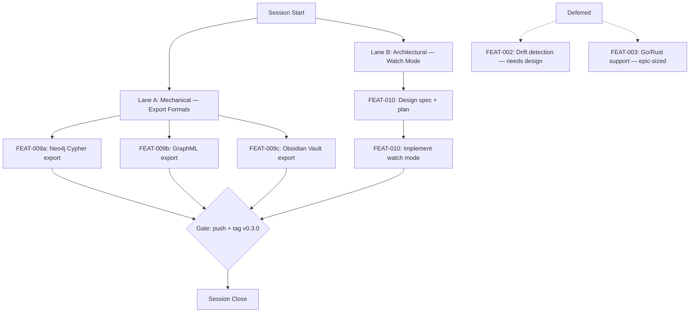

# Session Brief — 2026-04-12 (Session 6)

**Mode:** Autonomous LLM execution
**Last session:** Session 5 — completed FEAT-005 incremental builds (SHA256 cache), finished FEAT-008 leftovers, all pushed.

## Work Graph

## Approval Gates (STOP and ask user)

1. **GATE-1** — Push completed work to origin/main + optional tag v0.3.0
   - Risk: low
   - Status: ready after lane completion
   - Command: `git push origin main --tags`

## External Waits

- None — fully local development session.

## Parallel Lanes

### Lane A — Export Formats (FEAT-009)
- **FEAT-009a** — Neo4j Cypher export
  - Mode: mechanical
  - Context cost: M
  - Team dispatch: parallel subagent
  - Pre-reads: `crates/graphify-report/src/lib.rs`, `crates/graphify-report/src/html.rs` (pattern reference)
  - Done when: `graphify report` produces `.cypher` file with CREATE statements for nodes + MERGE for edges

- **FEAT-009b** — GraphML (XML) export
  - Mode: mechanical
  - Context cost: M
  - Team dispatch: parallel subagent
  - Pre-reads: `crates/graphify-report/src/lib.rs`, existing report patterns
  - Done when: `graphify report` produces `.graphml` file valid per GraphML XSD

- **FEAT-009c** — Obsidian Vault export
  - Mode: mechanical
  - Context cost: M
  - Team dispatch: parallel subagent
  - Pre-reads: `crates/graphify-report/src/lib.rs`, graph types
  - Done when: `graphify report` produces directory of `.md` files with `[[wikilinks]]` for edges

### Lane B — Watch Mode (FEAT-010)
- **FEAT-010** — Watch mode for auto-rebuild
  - Mode: architectural
  - Context cost: M
  - Team dispatch: solo after design spec
  - Pre-reads: `crates/graphify-cli/src/main.rs`, `crates/graphify-extract/src/cache.rs`
  - Done when: `graphify watch` rebuilds only changed files on save, uses FEAT-005 cache

## Sequential Chains

- **FEAT-010 design → FEAT-010 implement** — implementation depends on design spec decisions (notify crate, debounce strategy, rebuild scope)

## Decisions Made (don't re-debate)

- **Rust over Python** — standalone binary distribution (3.5MB vs 50-80MB)
- **petgraph over custom graph** — mature, Tarjan/SCC built-in
- **Louvain over Leiden** — no mature Rust Leiden crate
- **`is_package` via boolean parameter** — clean, testable
- **tree-sitter per call** — Parser is not Send
- **D3.js v7 vendored** — full offline self-containment
- **Force-directed layout** — simpler, proven for dependency graphs
- **SVG/Canvas auto-switch at 300 nodes**
- **Safe DOM construction** — createElement/textContent only
- **Workspace alias preservation** (BUG-007)
- **Singleton merging** (BUG-008)
- **Built-in test file exclusion** (BUG-006)
- **QueryEngine in graphify-core** (FEAT-006) — reusable for MCP
- **Re-extract on the fly** (FEAT-006) — always fresh data
- **No readline crate for REPL** (FEAT-006) — plain stdin, keep binary lean
- **GlobMatcher without external crate** (FEAT-006) — simple recursive byte matching
- **CI: strict clippy** (FEAT-004) — `-D warnings` fails the build on any lint
- **Separate binary for MCP** (FEAT-007) — keeps graphify-cli free of tokio/rmcp deps
- **Eager extraction on startup** (FEAT-007) — matches CLI pattern, instant tool responses
- **Config duplication** (FEAT-007) — small stable structs, extract later if third consumer
- **rmcp `#[tool(tool_box)]` macro** (FEAT-007) — actual API differs from docs
- **Arc wrapping for QueryEngine** (FEAT-007) — ServerHandler requires Clone
- **Per-project parameter on all tools** (FEAT-007) — optional, defaults to first project
- **Manual PartialEq/Eq for Edge** (FEAT-008) — f64::to_bits() for exact equality
- **Resolver returns confidence** (FEAT-008) — (String, bool, f64) tuple, never upgrade past extractor
- **Bare calls at 0.7/Inferred** (FEAT-008) — unqualified names are uncertain
- **Non-local downgrade to 0.5/Ambiguous** (FEAT-008) — external edges capped
- **Edge merge keeps max confidence** (FEAT-008) — most confident observation wins
- **Cache on by default** (FEAT-005) — `--force` to bypass, matches cargo/esbuild conventions
- **Per-file ExtractionResult caching** (FEAT-005) — resolution always re-runs (depends on full module set)
- **Cache in output directory** (FEAT-005) — `.graphify-cache.json` per project, discoverable
- **sha2 crate** (FEAT-005) — pure Rust, no system deps
- **No MCP caching** (FEAT-005) — MCP server is short-lived, deferred

## Out of Scope

- FEAT-002 (reason: architectural, needs adoption data + baseline concept design, own session)
- FEAT-003 (reason: epic-sized 16h, new tree-sitter grammars, needs own session)

## Context Budget Plan

- **Start of session**: read this brief + report crate patterns (~10k tok)
- **Lane A** (3 parallel mechanical tasks): ~15k tok each subagent, main context stays lean
- **After Lane A**: expect ~30% context used, no clear needed
- **Lane B** (architectural): design spec + implementation ~40k tok, may need checkpoint
- **Before GATE-1**: run full test suite, verify all outputs

## Re-Entry Hints (survive compaction)

If context resets mid-session:
1. Re-read `.claude/session-brief.md` (this file)
2. Run `git log origin/main..HEAD --oneline` to see what shipped since brief was written
3. Check `crates/graphify-report/src/` for new export modules (neo4j.rs, graphml.rs, obsidian.rs)
4. Run `cargo test --workspace` to verify current state
5. Resume from the first unchecked item in the work graph

## Team Dispatch Recommendations

- **Lane A** (3 mechanical tasks): parallel subagents — each format is independent, follows existing report pattern
- **Lane B** (architectural): solo after brainstorm — design spec first, then implement sequentially
- **Pre-push check**: run `cargo test --workspace && cargo clippy -- -D warnings` before GATE-1
