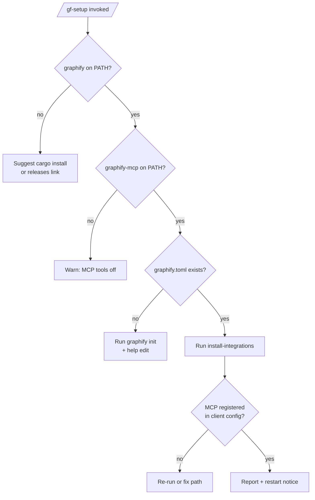

# AI Integrations

Graphify publishes first-class integrations for **Claude Code** and **Codex**. Once installed, the AI client exposes two surfaces backed by Graphify:

- **Slash commands** (`/gf-setup`, `/gf-analyze`, `/gf-onboard`, `/gf-refactor-plan`, `/gf-drift-check`) — scripted prompts your agent follows step-by-step.
- **MCP tools** (`graphify_stats`, `graphify_search`, `graphify_explain`, `graphify_path`, ...) — 9 live tools the AI can call without leaving the chat.

This page covers the install + config flow for **solo devs** and **teams**. For the underlying CLI, see [[install-integrations]].

## Prerequisites

| Requirement | Why |
|---|---|
| `graphify` binary on `PATH` | Installs artifacts + powers slash commands |
| `graphify-mcp` binary on `PATH` (same dir as `graphify`) | Powers MCP tools |
| `graphify.toml` at repo root | Tells Graphify which projects to analyze |
| Claude Code **or** Codex CLI installed | One of these must own `~/.claude/` or `~/.agents/skills/` |

See [[Installation]] for binary setup. Run `graphify init` to bootstrap `graphify.toml` (covered in [[Configuration]]).

## Solo dev — one-shot setup

```bash
graphify install-integrations
```

That's it. Auto-detects your client (`~/.claude/` and/or `~/.agents/skills/`) and:
1. Copies agents, skills, and slash commands into the client's directory
2. Merges the `graphify` MCP server into `~/.claude.json` and/or `~/.codex/config.toml`
3. Writes a `.graphify-install.json` manifest so `--uninstall` removes only what it added

Restart the client (required for MCP to load), then run `/gf-onboard` to get an architecture tour.

> [!tip] Shortcut after setup
> Once `/gf-setup` is installed, re-run it anytime from inside the client to verify + upgrade in one step. See [[#The /gf-setup flow]] below.

## Team setup (shared repo)

### Pattern A — Commit `.claude/` to the repo (recommended for Graphify)

Every teammate gets the same skills on `git clone`. Best when:
- The whole team uses Claude Code
- You want a single source of truth for prompts
- Teammates already have `graphify` binary available

```bash
# Maintainer (once)
graphify install-integrations --project-local
git add .claude/ .mcp.json
git commit -m "chore: install graphify AI integrations"
git push

# Teammates
git pull
# Inside Claude Code:
/gf-setup
```

> [!warning] Binary compatibility
> Committed `.claude/` artifacts target a specific `min_graphify_version`. When you bump Graphify, re-run `graphify install-integrations --project-local --force` and commit the diff. CI: pin the binary version in the team's setup script.

### Pattern B — Gitignore `.claude/` (each dev opts in)

Use when teammates mix Claude Code, Codex, and no-AI workflows — nobody is forced into a specific setup.

```bash
# .gitignore
.claude/
.mcp.json

# Teammates self-install
graphify install-integrations --project-local   # Claude Code
graphify install-integrations --codex           # Codex (always global)
```

### Pattern C — Global install only

Each teammate runs `graphify install-integrations` once (no `--project-local`). Artifacts land in `~/.claude/` and apply to every repo they open.

| Pattern | Scope | Onboarding cost | Version drift risk |
|---|---|---|---|
| A — commit `.claude/` | This repo | 1 command (`/gf-setup`) | Medium — binary must match |
| B — gitignore `.claude/` | This repo (opt-in) | 2 commands | Low |
| C — global | All repos | 1 command per dev | Low |

## The `/gf-setup` flow

Once `/gf-setup` exists in the client, it becomes the single entry point for install, upgrade, and diagnostics. Run it whenever:

- You pulled a new `graphify` binary version
- Someone edited `integrations/` and regenerated the lock
- MCP tools stopped responding
- A new teammate just cloned the repo

The command drives the AI through 6 checks:



Arguments forwarded to `graphify install-integrations`: `--project-local`, `--force`, `--uninstall`, `--skip-mcp`, `--dry-run`.

## What gets installed

### Claude Code (`~/.claude/` or `./.claude/`)

| Kind | File |
|---|---|
| Agent | `agents/graphify-analyst.md` (Opus, MCP-preferred) |
| Agent | `agents/graphify-ci-guardian.md` (Haiku, CLI-only) |
| Skill | `skills/graphify-onboarding/SKILL.md` |
| Skill | `skills/graphify-refactor-plan/SKILL.md` |
| Skill | `skills/graphify-drift-check/SKILL.md` |
| Command | `commands/gf-setup.md` |
| Command | `commands/gf-analyze.md` |
| Command | `commands/gf-onboard.md` |
| Command | `commands/gf-refactor-plan.md` |
| Command | `commands/gf-drift-check.md` |
| MCP | `~/.claude.json` (or `./.mcp.json`) gains `mcpServers.graphify` |

### Codex (`~/.agents/` + `~/.codex/`)

| Kind | File |
|---|---|
| Skill | `~/.agents/skills/graphify-onboarding/SKILL.md` (shared with Claude Code) |
| Skill | `~/.agents/skills/graphify-refactor-plan/SKILL.md` |
| Skill | `~/.agents/skills/graphify-drift-check/SKILL.md` |
| Agent bridge | `~/.agents/agents/graphify-analyst/` (or inline wrapper) |
| Agent bridge | `~/.agents/agents/graphify-ci-guardian/` |
| Command | `~/.codex/prompts/gf-setup.md` |
| Command | `~/.codex/prompts/gf-analyze.md` |
| Command | `~/.codex/prompts/gf-onboard.md` |
| Command | `~/.codex/prompts/gf-refactor-plan.md` |
| Command | `~/.codex/prompts/gf-drift-check.md` |
| MCP | `~/.codex/config.toml` gains `[mcp_servers.graphify]` |

> [!info] Codex + `--project-local`
> Codex **ignores** `--project-local` by design — its artifacts are always global. Only Claude Code honors project-local installs.

## Reload behavior

| Artefact | When it takes effect |
|---|---|
| Slash commands (`/gf-*`) | Next prompt (hot-reload) |
| Skills | Next prompt (hot-reload) |
| Agents | Next prompt (hot-reload) |
| **MCP server** | **Client restart** — MCP servers are bound on boot |

> [!warning] Most common pitfall
> "`/gf-analyze` works but `graphify_query` times out" → you forgot to restart the client after install.

## Upgrading

When you pull a newer `graphify` binary:

```bash
# Option 1 — re-run install (fastest)
graphify install-integrations --force

# Option 2 — from inside the client
/gf-setup --force
```

The manifest tracks sha256 hashes of installed files. Without `--force`, any file you hand-edited is preserved (reported as a conflict).

## Uninstalling

```bash
graphify install-integrations --uninstall
```

Uses `.graphify-install.json` to remove only Graphify's artifacts. Hand-edited files are skipped with a warning. MCP entries are removed from client configs; other `mcpServers` entries are preserved.

## CI usage

Use the CI guardian agent (CLI-only, no MCP) in GitHub Actions:

```yaml
- run: graphify install-integrations --claude-code --skip-mcp
- run: graphify run --config graphify.toml
- run: graphify check --config graphify.toml --json
- run: graphify diff --baseline report/baseline/analysis.json --config graphify.toml
- run: graphify pr-summary report/<project> >> $GITHUB_STEP_SUMMARY
```

`--skip-mcp` avoids touching `~/.claude.json` in the CI runner. See [[🔍 Quick Reference#CI gates]] for the full gate surface.

## Troubleshooting

### `command not found: graphify`
Binary not on `PATH`. See [[Installation]].

### `graphify-mcp: command not found`
MCP server binary is separate. Install with `cargo install --path crates/graphify-mcp --locked` or download alongside `graphify`.

### Slash commands don't appear
Check `~/.claude/commands/` (or `./.claude/commands/`) contains `gf-*.md`. If missing, re-run `graphify install-integrations --force`.

### MCP tools return "server not available"
Restart the client. If still broken, inspect the `mcpServers.graphify.command` path in `~/.claude.json` — it must point to an existing `graphify-mcp` binary.

### `conflicts: ...` during install
Someone edited an installed file. Either accept the diff (`--force`) or investigate the local change before overwriting.

### `no supported AI client detected`
You have neither `~/.claude/` nor `~/.agents/skills/`. Install Claude Code or Codex first, then retry.

## Related

- [[install-integrations]] — CLI reference
- [[MCP Server]] — MCP tool catalog
- [[Installation]] — binary setup
- [[Configuration]] — `graphify.toml` reference
- [[Troubleshooting]] — general debugging
