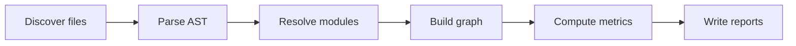

# First Steps

A 5-minute walkthrough: from zero to a readable architecture report.

## 1. Generate a starter config

```bash
cd /path/to/your/project
graphify init
```

This writes `graphify.toml` in the current directory. Edit it if needed (see [[Configuration]]). Most Python and TypeScript projects work with the defaults.

## 2. Run the full pipeline

```bash
graphify run --config graphify.toml
```

Pipeline stages:



Expected output (stderr):

```
[graphify] discovering files in ./apps/ana-service
[graphify] extracted 142 files (cached: 0/142)
[graphify] computing metrics...
[graphify] wrote ./report/ana-service/
```

## 3. Read the report

The most useful files for a first look:

| File | Open with | What you get |
|---|---|---|
| `architecture_report.md` | Obsidian, VS Code | Top hotspots, cycles, communities — narrative |
| `architecture_graph.html` | Browser | Interactive D3.js force graph (drag, filter, search) |
| `analysis.json` | jq, scripts | Structured metrics for automation |

```bash
open ./report/<project>/architecture_graph.html
```

> [!tip] Quick scan
> Read `architecture_report.md` first — it surfaces the top-N hotspots and any cycles. Move to the HTML graph when you want to **explore** instead of **read**.

## 4. Explore the graph

```bash
# Find all modules under a glob
graphify query "app.services.*" --config graphify.toml

# Show impact + profile of one node
graphify explain app.services.llm --config graphify.toml

# Find a dependency path between two nodes
graphify path app.main app.services.llm --config graphify.toml

# Interactive REPL
graphify shell --config graphify.toml
```

> [!info] No cache for queries
> Query commands always re-extract. They're meant to reflect the current source state, not a snapshot.

## 5. Iterate with watch mode

For ongoing work — Graphify rebuilds only the affected projects on file change:

```bash
graphify watch --config graphify.toml
```

300ms debounce. Per-project path matching means a TS edit doesn't re-extract your Python project.

## 6. Detect drift between two versions

After a refactor, compare against the previous report:

```bash
# Save a baseline
cp -r report report-baseline

# Make changes...
# Re-run
graphify run --config graphify.toml

# Diff
graphify diff \
  --before report-baseline/<project>/analysis.json \
  --after  report/<project>/analysis.json
```

Outputs `drift-report.{json,md}` covering 5 dimensions: summary, edges, cycles, hotspots, communities.

## 7. Add CI gates (optional)

If you want Graphify to fail PRs on architectural regressions:

```bash
graphify check --config graphify.toml
# exit 1 if any cycle/hotspot/policy/contract violation
```

Wire this into GitHub Actions / your CI of choice. Pair with `graphify pr-summary` to render a Markdown comment for the PR.

## Common next steps

| Goal | Page |
|---|---|
| Tune what's analyzed | [[Configuration]] |
| Look up a term | [[Terms\|Glossary]] |
| Hit an error | [[Troubleshooting]] |
| Memorize commands | [[🔍 Quick Reference]] |
| Understand the architecture | [[System Overview]] |
