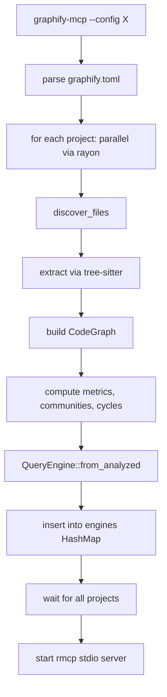

# `graphify-mcp`

The Model Context Protocol server. A separate binary that exposes Graphify's `QueryEngine` as MCP tools so AI assistants (Claude Code, Codex, etc.) can query the dependency graph during a coding session.

## Overview

| Property | Value |
|---|---|
| Path | `crates/graphify-mcp/` |
| Binary? | Yes — `graphify-mcp` |
| Lines of code | ~1100 (main.rs: 369, server.rs: 726) |
| Files | 2 |
| Transport | stdio (JSON-RPC 2.0) |
| Depends on | `graphify-core`, `graphify-extract`, `rmcp`, `tokio`, `clap`, `toml`, `serde`, `serde_json`, `schemars`, `rayon` |
| Depended by | — (binary) |

## Purpose

Speak MCP. The protocol is JSON-RPC 2.0 over stdio. AI assistants connect once per session, the server extracts all configured projects eagerly, and then any tool call routes to the right `QueryEngine` and returns structured JSON. **Lean CLI users don't pay for this**: `graphify-mcp` is a separate binary that pulls `tokio` and `rmcp` only when needed.

## File map

| File | LOC | Role |
|---|---|---|
| `main.rs` | 369 | Config parsing, eager extraction loop, server bootstrap |
| `server.rs` | 726 | `GraphifyServer` struct + 9 MCP tool handlers + `ServerHandler` impl |

## MCP tools exposed

All 9 `QueryEngine` methods are surfaced as MCP tools. Every tool accepts an optional `project` parameter (defaults to the first project in config).

| Tool | Backed by |
|---|---|
| `graphify_stats` | `QueryEngine::stats()` |
| `graphify_search` | `QueryEngine::search(pattern, filters)` |
| `graphify_explain` | `QueryEngine::explain(node_id)` |
| `graphify_path` | `QueryEngine::shortest_path(from, to)` |
| `graphify_all_paths` | `QueryEngine::all_paths(from, to, max_depth, max_paths)` |
| `graphify_dependents` | `QueryEngine::dependents(node_id)` |
| `graphify_dependencies` | `QueryEngine::dependencies(node_id)` |
| `graphify_transitive_dependents` | `QueryEngine::transitive_dependents(id, max_depth)` |
| `graphify_suggest` | `QueryEngine::suggest(input)` |

→ Detailed schemas in the design spec: `docs/superpowers/specs/2026-04-12-feat-007-mcp-server-design.md`.

## Server structure

```rust
struct GraphifyServer {
    engines: HashMap<String, Arc<QueryEngine>>,
    default_project: String,
    project_names: Vec<String>,
}
```

- `Arc<QueryEngine>` because `rmcp::ServerHandler` requires `Clone`
- `default_project` = first project in config; tools fall back to it when `project` is omitted
- `engines` populated **eagerly** at startup — no lazy init

## Startup flow



Total startup: ~1–3s for typical codebases. Acceptable because MCP servers are long-lived (one per editor session).

## Design properties

### Stdio discipline

- **stdout**: JSON-RPC protocol only. Anything written here that isn't valid JSON-RPC corrupts the connection.
- **stderr**: All diagnostic output (extraction progress, warnings, errors during startup).

If you wrap or instrument this binary, **do not** print to stdout. This is the most common reason MCP integrations break.

### Config duplicated from CLI

By design ([[ADR-005 MCP Server]]). Config structs (`Config`, `Settings`, `ProjectConfig`) and the extraction pipeline are duplicated from `graphify-cli/src/main.rs`. Two consumers, small and stable types, extracting to a shared crate would be premature.

If a third consumer ever appears, lift these into a `graphify-config` crate.

### `rmcp` v0.1 macro quirks

The implementation uses `#[tool(tool_box)]`. Note that current `rmcp` docs describe `#[tool_router]` — the API has shifted. Pin the version (`0.1`) and consult the source until v1.0.

### No incremental refresh

The graph is frozen for the duration of the session. Code edits during a session are **not** reflected. To pick up changes, restart the server (the editor's MCP integration usually has a "reload" command).

A future feature could pair MCP with `notify` (the watch crate already in workspace) to refresh on changes — but it's not implemented today.

## Client configuration

### Claude Code (`.mcp.json` or `~/.claude.json`)

```json
{
  "mcpServers": {
    "graphify": {
      "command": "graphify-mcp",
      "args": ["--config", "/absolute/path/to/graphify.toml"]
    }
  }
}
```

### Claude Desktop (`claude_desktop_config.json`)

Same schema under `mcpServers`.

## Testing

```bash
cargo test -p graphify-mcp
```

Unit tests build small in-memory `CodeGraph`s and call tool handlers directly. Integration tests spawn `graphify-mcp` as a subprocess and exchange JSON-RPC messages over its stdio handles.

## Common gotchas

- **stdout pollution** kills the protocol. If wrapping the binary, redirect stderr only — never write to stdout.
- **Eager extraction** can take seconds on huge monorepos. The MCP client may time out the `initialize` handshake. Consider running it once per workspace, not per file.
- **`Arc<QueryEngine>`** means cloning is cheap, but mutating the graph isn't possible without `Mutex`/`RwLock`. By design — the graph is read-only for the session.
- **`rmcp` is pre-1.0.** Future API breaks are likely; pin the version and budget time for upgrades.
- **No project specified** → default project is the **first** in `graphify.toml`. Order matters.

## Related

- [[Data Flow]] — MCP variant section
- [[Crate - graphify-cli]] — sister binary (config duplicated)
- [[Crate - graphify-core]] — source of `QueryEngine` and types
- [[ADR-005 MCP Server]] — design rationale
