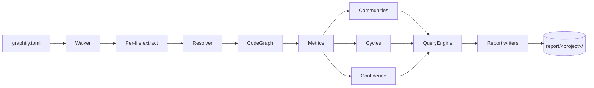
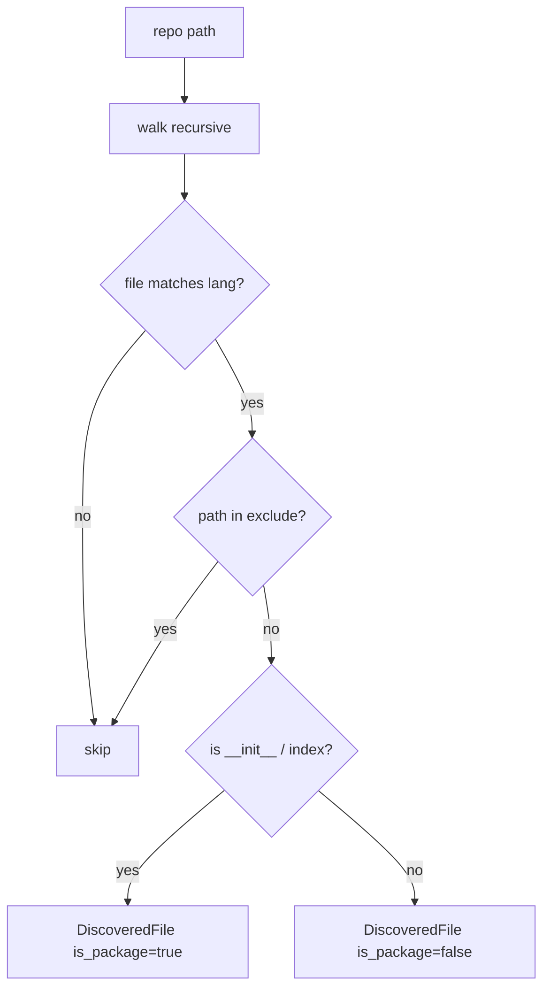
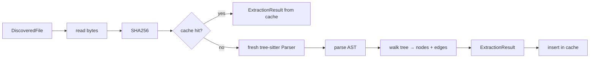
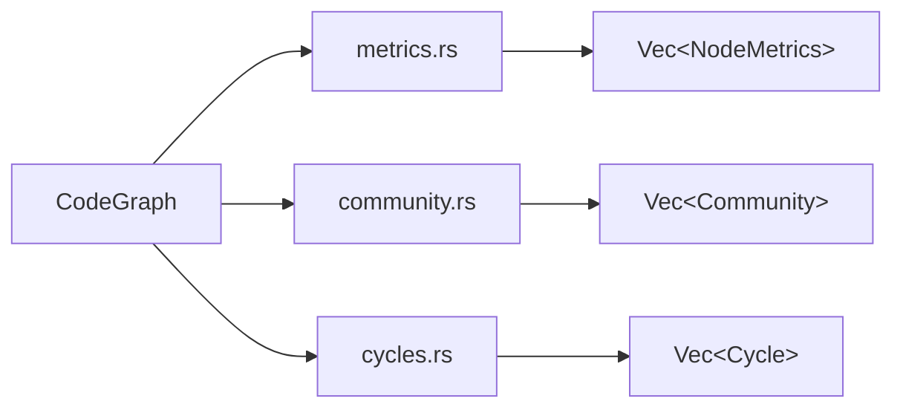
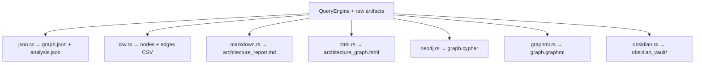
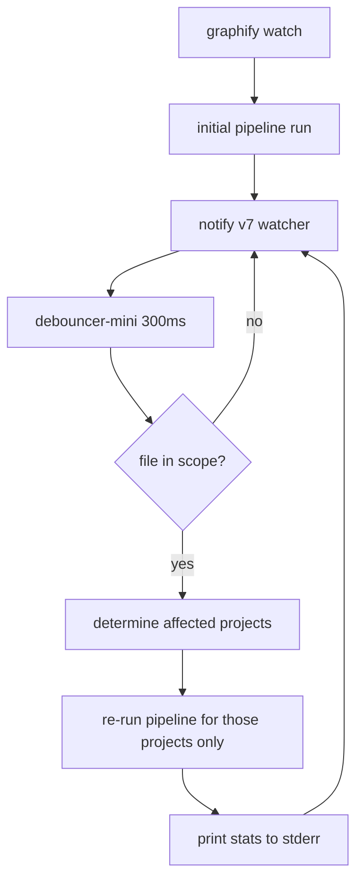
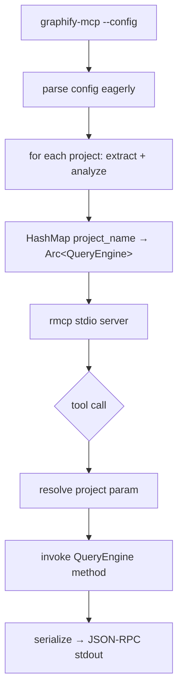

# Data Flow

End-to-end view of how a `graphify run` invocation transforms `graphify.toml` + source files into the report set on disk.

## High-level pipeline



## Stage-by-stage walkthrough

### 1. Configuration

Source: `graphify.toml`

- Parsed by `graphify-cli/src/main.rs` via `serde::Deserialize` + `toml`
- Per-project `[[project]]` blocks loop through stages 2–8 in parallel via `rayon`
- `[settings]` controls global behavior (output dir, weights, formats, exclusions)
- `[contract]` (optional) drives [[ADR-011 Contract Drift Detection]]
- `[policy]` (optional) drives architecture rules ([[ADR-008 CI Quality Gates]])

→ See [[Configuration]] for reference.

### 2. File discovery (Walker)

Code: `graphify-extract/src/walker.rs` (`discover_files`, `detect_local_prefix`)



- Excludes `__pycache__`, `node_modules`, `.git`, `dist`, `tests`, `__tests__`, `.next`, `build`, `.venv`, `venv` by default
- Excludes test files via glob: `*.test.{ts,tsx,js,jsx}`, `*.spec.{ts,tsx,js,jsx}`, `*.test.py`, `*_test.py`
- `is_package` flag tracks `__init__.py` / `index.ts` for relative-import resolution ([[ADR-001 Rust Rewrite]] callout, BUG-001)
- When `local_prefix` is omitted, runs the auto-detection heuristic ([[ADR-010 Auto-Detect Local Prefix]])

Output: `Vec<DiscoveredFile>` per project.

### 3. Per-file extraction

Code: `graphify-extract/src/{python,typescript,go,rust_lang}.rs`

Parallelized via `rayon::par_iter`:



- One **fresh** tree-sitter `Parser` per file (Parser is `!Send`)
- Cache logic: [[ADR-003 SHA256 Extraction Cache]] — bypassed by `--force` and by all `query`/`path`/`explain`/`shell` commands
- Edges carry initial `confidence` from the extractor (1.0 / Extracted by default; bare calls 0.7 / Inferred — see [[ADR-006 Edge Confidence Scoring]])

### 4. Module resolution

Code: `graphify-extract/src/resolver.rs`

For each edge with a raw target string, returns `(canonical_id, is_local, confidence)`:

| Resolution path | Confidence |
|---|---|
| Direct exact match | 1.0 |
| Python relative import (with `is_package`) | 0.9 |
| TS relative import | 0.9 |
| TS path alias from `tsconfig.json` | 0.85 |
| Unknown / non-local | downgraded to ≤0.5 / `Ambiguous` |

The pipeline applies `min(extractor_confidence, resolver_confidence)`, then the non-local downgrade, then merges duplicates keeping the **maximum** observed confidence.

### 5. Graph build

Code: `graphify-core/src/graph.rs` (`CodeGraph`)

- Wraps `petgraph::DiGraph<Node, Edge>` with deduplication and weight increment on duplicate edges
- Repeated calls increment `Edge.weight` instead of creating duplicates
- Edge merge keeps the maximum confidence across observations

### 6. Analysis

Code: `graphify-core/src/{metrics,community,cycles}.rs`

Three independent computations on `CodeGraph`:



| Concern | Algorithm | Notes |
|---|---|---|
| Betweenness centrality | Brandes, sampled `k = min(200, n)` | Custom impl on petgraph |
| PageRank | Iterative, damping=0.85 | ~40 LOC custom |
| In/Out degree | Direct count | petgraph native |
| Communities | Louvain → Label Propagation fallback | Phase 2 merges singletons |
| Cycles | Tarjan SCC + simple cycles (cap 500) | Per-SCC cap to bound runtime |

The `score` field on each `NodeMetrics` is the unified weighted composite (default `[0.4, 0.2, 0.2, 0.2]`) — see [[Configuration]].

### 7. QueryEngine assembly

Code: `graphify-core/src/query.rs` (`QueryEngine::from_analyzed`)

Bundles the analyzed data into a query-ready handle:

```rust
QueryEngine {
    graph: CodeGraph,
    metrics: Vec<NodeMetrics>,
    communities: Vec<Community>,
    cycles: Vec<CycleGroup>,
}
```

Used by:
- `graphify query/path/explain/shell` (CLI)
- `graphify-mcp` (one engine per project, in `Arc`)
- The report writers, indirectly

### 8. Report generation

Code: `graphify-report/src/*.rs` — one module per format.



Each writer is **pure**: takes data, returns a string or writes a file. No domain logic — any format-specific shaping (CSV column order, Markdown table formatting) lives next to its writer.

Selected by `[settings].format = ["json", "csv", "md", "html", ...]` in config.

### 9. Cross-cutting outputs (when applicable)

Generated **after** all per-project pipelines complete:

| Output | When | Producer |
|---|---|---|
| `graphify-summary.json` | 2+ projects configured | CLI, post-loop |
| `drift-report.{json,md}` | `graphify diff` invoked | `graphify-core::diff` + `graphify-report::diff_*` |
| `check-report.json` | `graphify check` invoked (always written under FEAT-015) | `graphify-cli` |
| `trend-report.{json,md}` | `graphify trend` invoked | `graphify-core::history` + `graphify-report::trend_*` |
| `pr-summary` (stdout) | `graphify pr-summary <DIR>` invoked | `graphify-report::pr_summary` |

## Watch mode variant

Code: `graphify-cli/src/watch.rs` ([[ADR-009 Watch Mode]])



- `WatchFilter` reuses the same extension/exclude logic as the walker
- Output dir is excluded to avoid feedback loops
- Cache hits make rebuilds sub-second

## MCP variant

Code: `graphify-mcp/src/{main,server}.rs` ([[ADR-005 MCP Server]])



- Stdout reserved for protocol; all diagnostics on stderr
- Eager extraction at startup keeps tool calls instant
- No re-extraction during a session — code edits don't update the graph (planned future work)

## Related

- [[System Overview]]
- [[Tech Stack]]
- [[Crate - graphify-core]] · [[Crate - graphify-extract]] · [[Crate - graphify-report]] · [[Crate - graphify-cli]] · [[Crate - graphify-mcp]]
- [[ADR-Index]]
