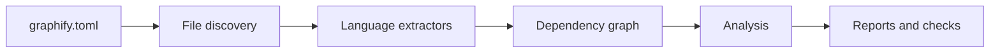

# System Overview

## Summary

Graphify is a Rust CLI for architectural analysis of codebases. It scans source files, extracts static dependencies, builds a graph representation of the system, computes architecture metrics, and generates reports that help identify hotspots, cycles, module communities, and structural drift.

> [!info] Primary Use Case
> Use Graphify to understand how modules depend on each other, detect architectural risks early, and enforce architecture rules in CI.

## What The Application Does

Graphify turns source code into a navigable dependency graph and then uses that graph for analysis and reporting.

The application supports workflows such as:

- Extracting dependencies from supported languages with AST-based parsing
- Building a graph of modules, symbols, and relationships
- Computing metrics such as centrality, PageRank, cycles, and communities
- Generating Markdown, JSON, CSV, HTML, GraphML, Neo4j, and Obsidian outputs
- Comparing snapshots to detect architectural drift
- Enforcing quality gates and declarative policy rules in CI
- Detecting contract drift between ORM schemas and TypeScript contracts

## Main Flow

### Pipeline

1. Graphify reads `graphify.toml` to discover which projects should be analyzed.
2. It walks each project directory and filters relevant source files.
3. Language-specific extractors parse files and emit nodes and edges.
4. The resolver normalizes identifiers and module references.
5. A graph is built and enriched with metrics.
6. The CLI writes reports and optional CI gate results.

## Main Commands

| Command | Purpose |
|---|---|
| `graphify init` | Generate a starter config file |
| `graphify extract` | Build the raw dependency graph |
| `graphify analyze` | Compute architectural metrics |
| `graphify report` | Generate the full report set |
| `graphify run` | Run the full pipeline |
| `graphify check` | Validate architecture gates for CI |
| `graphify diff` | Compare snapshots and report drift |
| `graphify trend` | Aggregate historical architecture trends |
| `graphify query` | Search the graph |
| `graphify explain` | Show impact and profile for one node |
| `graphify path` | Find dependency paths between nodes |
| `graphify pr-summary` | Render a PR-ready architecture summary |
| `graphify watch` | Rebuild on file changes |
| `graphify shell` | Explore the graph interactively |

## Workspace Structure

| Crate | Responsibility |
|---|---|
| `graphify-core` | Graph model, metrics, cycles, communities, diff, policy |
| `graphify-extract` | File walking, AST extraction, module resolution, cache |
| `graphify-report` | Output generation for reports and exports |
| `graphify-cli` | CLI commands and pipeline orchestration |
| `graphify-mcp` | MCP server for AI-assisted graph queries |

## Key Outputs

| Output | Description |
|---|---|
| `graph.json` | Dependency graph in JSON form |
| `analysis.json` | Metrics, cycles, communities, and confidence data |
| `architecture_report.md` | Human-readable architecture report |
| `architecture_graph.html` | Interactive graph visualization |
| `check-report.json` | CI-oriented gate results |
| `drift-report.json` | Snapshot comparison results |
| `trend-report.md` | Historical architecture summary |

## Why It Exists

Graphify exists to make architecture visible. Instead of relying on manual inspection of a growing codebase, it produces structural evidence that helps developers:

- find risky concentration points
- detect unintended coupling
- monitor architecture changes over time
- validate architectural boundaries automatically

## Related

- [[README]]
- [[CLAUDE]]
- [[../TaskNotes/Tasks/FEAT-004-ci-quality-gates]]
- [[../TaskNotes/Tasks/FEAT-016-contract-drift-detection-between-orm-and-typescript]]
