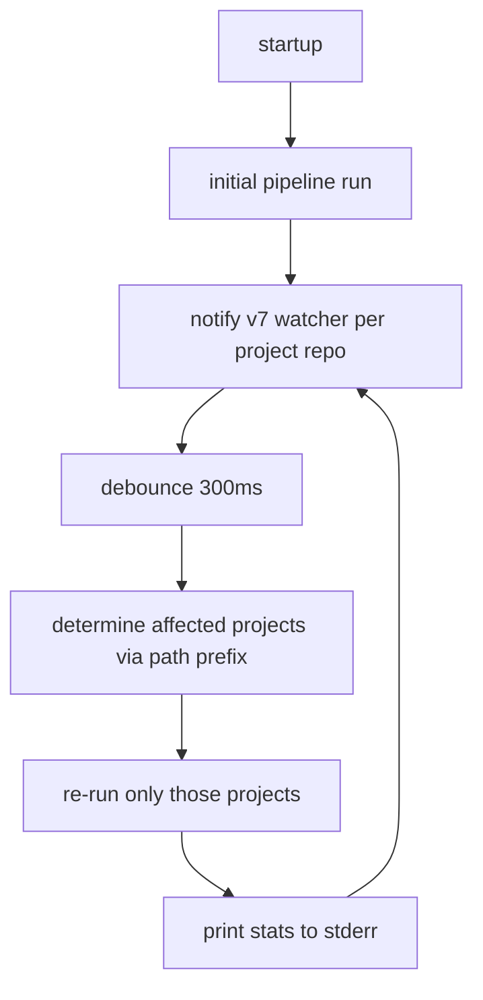

# `graphify watch`

Watch source files and re-run the pipeline on change, with a 300ms debounce window. Leans on the SHA256 cache for sub-second rebuilds. **Per-project rebuild scope** — a TS edit doesn't touch your Python project.

## Synopsis

```bash
graphify watch [--config <path>] [--output <dir>] [--force] [--format <list>]
```

## Arguments

None.

## Flags

| Flag | Default | Description |
|---|---|---|
| `--config <path>` | `graphify.toml` | Path to config file |
| `--output <dir>` | `[settings].output` | Override output directory |
| `--force` | `false` | Bypass cache **on first run only** (subsequent rebuilds always use cache) |
| `--format <list>` | `[settings].format` | Override output formats |

## Behavior



- File watcher: `notify` v7 with `notify-debouncer-mini` 0.5
- Output directory is **excluded** from watching to avoid feedback loops
- Config file is **not** watched — restart `graphify watch` after editing `graphify.toml`
- Excludes match the walker's behavior (`__pycache__`, `node_modules`, `.git`, `dist`, etc.)

## Examples

```bash
# Default behavior
graphify watch

# Force a clean rebuild on the first cycle, then warm cache
graphify watch --force

# Watch only Markdown + HTML output
graphify watch --format md,html
```

## Output

Same as [[run]] — files written under `<output>/<project>/` on every rebuild. Stderr stream:

```
[ana-service] Cache: 142/142 hits, 0 misses → rebuild in 0.4s
```

## Exit codes

| Code | Meaning |
|---|---|
| 0 | Clean exit (Ctrl+C / SIGINT) |
| 1 | Watcher init failed, config error, or "too many open files" |

## Gotchas

- **`--force` only applies to the initial build.** To force a fresh rebuild mid-session, restart watch.
- **Config edits are ignored** by the watcher. Edit `graphify.toml`, then restart.
- **High CPU on big repos**: the per-project rebuild can still be heavy on monorepos with thousands of files. Mitigations:
  - Split into smaller `[[project]]` blocks
  - Tighten `exclude` to skip generated dirs
  - Run Graphify on `pre-push` instead of save
- **Browser doesn't auto-reload** the HTML graph — refresh manually.
- **File watcher tests are flaky by nature** (timing-dependent); rely on manual verification when debugging.

## See also

- [[run]] — same pipeline, one-shot
- [[ADR-009 Watch Mode]] — design rationale
- [[ADR-003 SHA256 Extraction Cache]] — what makes rebuilds cheap
- [[Troubleshooting#Watch mode]]
