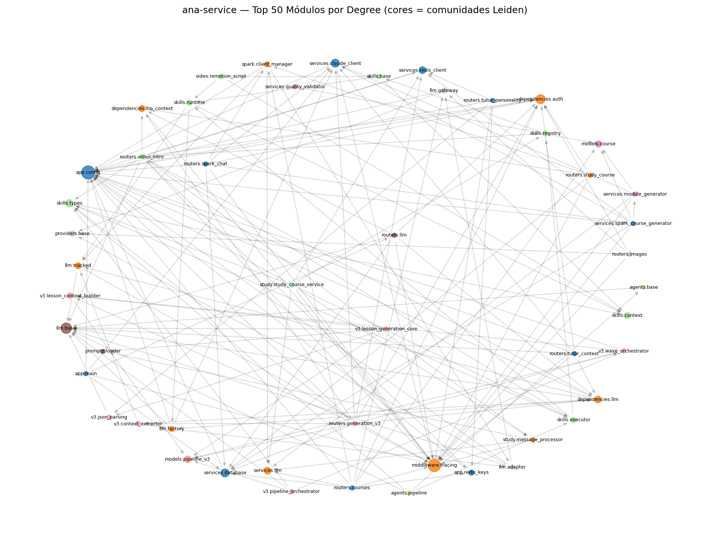

# Graphify — Relatório Arquitetural: ana-service

## Visão Geral

- **Repositório:** ana-service (`~/www/cursos/apps/ana-service`)
- **Baseline:** `graphify-baseline-v1` (commit `4162827d`)
- **Ferramenta:** Graphify com tree-sitter + NetworkX + Leiden
- **Nós (locais):** 308
- **Arestas:** 912
- **Comunidades Leiden:** 40
- **Ciclos de dependência:** 3

## Tabela de Módulos — Top 10 Hotspots

| # | Módulo | In | Out | Betweenness | PageRank | I | Arquivo |
|---|---|---|---|---|---|---|---|
| 1 | `app.services.llm.base` | 63 | 0 | 0.0 | 0.043 | 0.0 | `app/services/llm/base.py` |
| 2 | `app.config` | 47 | 0 | 0.0 | 0.055906 | 0.0 | `app/config.py` |
| 3 | `app.middleware.tracing` | 53 | 0 | 0.0 | 0.026468 | 0.0 | `app/middleware/tracing.py` |
| 4 | `app.services.llm.factory` | 7 | 5 | 0.018073 | 0.006237 | 0.4167 | `app/services/llm/factory.py` |
| 5 | `app.skills.runtime` | 14 | 4 | 0.012805 | 0.009861 | 0.2222 | `app/skills/runtime.py` |
| 6 | `app.prompts.loader` | 33 | 0 | 0.0 | 0.020668 | 0.0 | `app/prompts/loader.py` |
| 7 | `app.skills.executor` | 6 | 7 | 0.012512 | 0.003326 | 0.5385 | `app/skills/executor.py` |
| 8 | `app.services.claude_client` | 13 | 10 | 0.008216 | 0.006063 | 0.4348 | `app/services/claude_client.py` |
| 9 | `app.skills.registry` | 6 | 5 | 0.010811 | 0.003367 | 0.4545 | `app/skills/registry.py` |
| 10 | `app.models.pipeline_v3` | 22 | 0 | 0.0 | 0.019821 | 0.0 | `app/models/pipeline_v3.py` |

## Hotspots Priorizados

### 1. `app.services.llm.base` — God Module (Fan-in excessivo)

- **Evidência:** betweenness=0.0, in_degree=63, I=0.0
- **Risco:** Mudança neste módulo propaga para 63 dependentes
- **Ação:** Investigar se todas as 63 dependências são necessárias
- **Arquivo:** `app/services/llm/base.py`

### 2. `app.config` — God Module (Fan-in excessivo)

- **Evidência:** betweenness=0.0, in_degree=47, I=0.0
- **Risco:** Mudança neste módulo propaga para 47 dependentes
- **Ação:** Investigar se todas as 47 dependências são necessárias
- **Arquivo:** `app/config.py`

### 3. `app.middleware.tracing` — God Module (Fan-in excessivo)

- **Evidência:** betweenness=0.0, in_degree=53, I=0.0
- **Risco:** Mudança neste módulo propaga para 53 dependentes
- **Ação:** Investigar se todas as 53 dependências são necessárias
- **Arquivo:** `app/middleware/tracing.py`

### 4. `app.services.llm.factory` — High Betweenness (Ponte)

- **Evidência:** betweenness=0.018073, in_degree=7, I=0.4167
- **Risco:** Mudança neste módulo propaga para 7 dependentes
- **Ação:** Extrair interface — reduzir btw abaixo de 0.005
- **Arquivo:** `app/services/llm/factory.py`

### 5. `app.skills.runtime` — High Betweenness (Ponte)

- **Evidência:** betweenness=0.012805, in_degree=14, I=0.2222
- **Risco:** Mudança neste módulo propaga para 14 dependentes
- **Ação:** Extrair interface — reduzir btw abaixo de 0.005
- **Arquivo:** `app/skills/runtime.py`

## Dependências Circulares

1. **3 nós:** `app.services.redis_client` → `app.services.context7_client` → `app.monitoring`
2. **2 nós:** `app.services.claude_client` → `app.services.streaming`
3. **8 nós:** `app.services.validators.herbart` → `app.services.validators.language` → `app.services.validators.bilingual` → `app.services.validators.montessori` → `app.services.validators.froebel` → `app.services.quality_validator`

## Visualização

## Simulação de Refatoração — Antes/Depois

**Refatoração simulada:** Quebrar o maior ciclo de dependências removendo arestas circulares.

**Arestas removidas:** `app.services.validators` → `app.services.validators.herbart`

| Métrica | Antes | Depois | Delta |
|---|---|---|---|
| Ciclos (SCC > 1) | 3 | 3 | 0 |
| Betweenness (`app.services.llm.base`) | 0.0 | 0.0 | 0.0 |

## Recomendações Finais

1. **Resolver ciclo de validators (8 nós):** Extrair `validators/base.py` com interface comum
2. **Monitorar `app.middleware.tracing` (in=53):** Verificar se todas as dependências são necessárias
3. **Estabilizar `app.services.llm.factory` (btw=0.016):** Ponte crítica entre domínios — adicionar testes de contrato

---
*Gerado por Graphify — análise reproduzível no baseline `graphify-baseline-v1`*